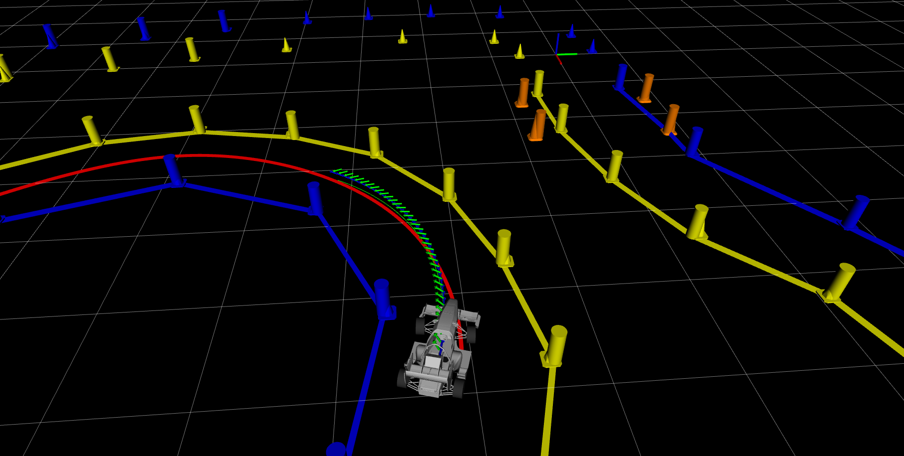

 

<h3 align="center">Tailored MPC</h3>

Here you can find the main Autonomous Systems controller for CAT15x, the [BCN eMotorsport](https://bcnemotorsport.upc.edu) 2022-23 car. Within this repo you will find 3 different MPC controllers: time-variant, spatial-variant and lateral (also time-variant). The one used for the 2022-2023 season is the lateral approach, leaving the others for a future implementation as they demand much more testing time.

    
Table of Contents

    <ol>
        <li>
        <a href="#disclaimer">Disclaimer</a>
        </li>
        <li><a href="#dependencies">Dependencies</a>
        </li>
        <li>
        <a href="#approach">Approach</a>
        </li>
        <li>
        <a href="#workflow">Workflow</a>
        </li>
    </ol>

# Disclaimer
This is a tailored control solution made for the CAT15x Formula Student vehicle. In order to make a propper use of this algorithm, it's the user duty to make sure the [dynamic model](docs/tfg.pdf) actually approximates the behaviour of the car. 

If you use this control algorithm in a Formula Student competition the **only** thing I ask for is to **ALWAYS REFERENCE** the team ___BCN eMotorsport___.

# Dependencies
* [Ubuntu](https://ubuntu.com/) 20.04
* [ROS](https://www.ros.org/) Noetic
* [Embotech](https://www.embotech.com/products/forcespro/overview/) FORCESPRO solver. A Hardware or Software Embotech license is mandatory.
* [Eigen3](https://eigen.tuxfamily.org)
* ___as_msgs___: self-defined ROS msgs pkg. You may change it for yours, adapting the [necessary callbacks](include/mpc.hh).

# Approach

For specific information on how the lateral controller work read [Tailored MPC](docs/tfg.pdf)'s paper.

For the sake of simplicity the different controllers are named after their more important characteristic. However, all the specified MPC controllers are curvature-based and follow a simplified non linear bicycle model.

## Branches
Here's a quick explanation of this project branches:

* `master` : time-dependant Non Linear MPC. Here a coupled (longitudinal+lateral dynamics) autonomous controller is specified. The main characteristics of this controller are:
    * High computational load (30ms)
    * Curvature based.
    * Handles throttle + steering commands.
    * Complex/Time consuming tuning.
    * High specialization (different parameters for each dynamic event).
    * No need for velocity profile input.
* `lateral` : time-dependant Non Linear MPC. Here a decoupled (lateral dynamics) autonomous controller is specified. The main characteristics of this controller are:
    * Lower computational load (10ms).
    * Curvature based.
    * Handles steering commands.
    * Lower tuning complexity.
    * Must have a velocity profile as input for the whole horizon length (prediction horizon).
    * A longitudinal controller must run in parallel, following as close as possible the given velocity profile.
* `spatial` : space-dependant Non Linear MPC. Here a coupled (lateral+longitudinal dynamics) autonomous controller is specified. The main characteristics of this controller are:
    * High computational load (30ms)
    * Curvature based.
    * Handles throttle + steering commands.
    * Complex/Time consuming tuning
    * No need for velocity profile input
    * High specialization (different parameters for each dynamic event).
    * Space dependant output, must be extrapolated into the time domain afterwards.
    * Adaptive integration step. Depending on the meters covered by the planner the spatial integration step can be bigger/lower.

__NOTE:__ The other branches are still in an early development process. They're not ready for deployment!

# Workflow

Here's a quick summary of the steps taken by the algorithm in each iteration.

In order to solve the Non Linear Optimization Problem (NLOP) defined with the [solver declaration API](solver/FORCES_problem.m) the following procedure is followed (in this order):

* __Initial conditions__: the initial conditions for all the state/control variables must be computed. Usually the only unkown initial conditions are the path tracking variables `n` & `mu` so they must be calculated using the actual car state and the planned trajectory. 

* __Real time parameters & variable boundaries__: the value of all the used real time parameters (or constant variables) must be given to the NLOP. A value for each parameter for each horizon stage must be set, meaning an array of __m__ x __n__ (where __m__ == number of parameters and __n__ == horizon length) must be filled. The same logic is applied to the boundaries array.

* __Memory buffer__: FORCESPRO's solver enable us to control the RAM used by the solver and set memory buffers to be used by the c-generated solver software. _We don't really need this tool so we let FORCESPRO full control on that aspect._

* __Solve__: a call to the solver declaration must be made in order to solve the NLOP. It takes as arguments the __m__ x __n__ parameters array & boundaries array, a pointer to the memory handler, an array to fill with the found solution, an array to fill with solving procedure information and a reference to the Algorithmic Differentiation (AD) function (usually c-generated by FORCESPRO). _If a self-developed AD tool is wanted, a reference to the c++ function should be given instead of the default one._

* __Get Solution__: after the NLOP is solved, the given empty solution array will be filled with a solution for each optimization variable for each horizon stage. _It becomes handy to copy this solution to some other data structures in order to work with the given solutions easily._

* __Progress Prediction__: finally, a progress (s) prediction should be computed using the NLOP solution in order to use this information when setting the curvature values for the next solver call (next iteration). _Basically, knowing the progress for each predicted state we can look for the closest planner points for each state and pick their curvature values for the next iteration. This heuristic procedure tends to help the NLOP convergence._
